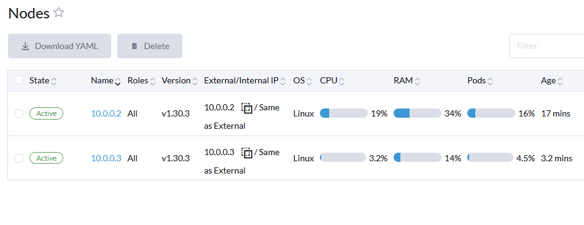
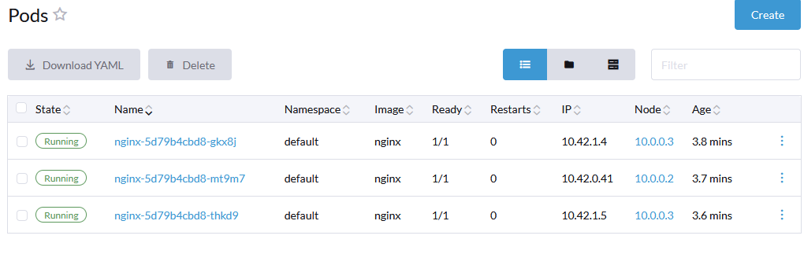

```
instance_internal_ips = [
  "10.0.0.2",
  "10.0.0.3",
]
instance_ips = [
  "34.68.131.157",
  "104.155.187.17",
]
```

# Single Node | RKE v1.6.1 | Rancher 2.9 | Kubernetes v1.29.7

```
ssh -i rancher-multinode/rancher-key.pem rancher@34.68.131.157
```


```
pastikan ssh ke semua server
sudo su
cat /home/serverdevops/cluster.yml
su serverdevops
cat /home/serverdevops/.ssh/id_rsa.pub
echo "ssh-rsa AAAAB3NzaC1yc2EAAAADAQABAAABAQC+TaFK4EJQ55wwUCGrQuCvGr5oW40NuIL80sjQE/XZgiNDIoL/Lgn6XOrTGN6n8MhMJd9Q5qNrELV6tSTYdPm82A1Xishq29dkovrRNLohBm2grxRaqM37TtsKDUKPRe0VxPtPL9WyD29xgKWHZFSbpnkmPtdYLcm6f7UOFCEHNYG4Qtf/Cj8J4Ji57BJWCjCLFs9K07WfmnHVZs9lRUrVB03woh2GzkqZvliMjN13nQagPI/sHqj6/VAnmlUDbJvBsnnJvyihSonJQVLZv3VwbN6BrgfOEnGZUdnuaQmYR5z76XG7+EtBe/lOGYGyBe2xZ1YY/MMeqDOBF92Wu2pX ansible-generated on rancher-node-1" >> ~/.ssh/authorized_keys
ssh serverdevops@10.0.0.2
```

```
cd /home/serverdevops/
nano cluster.yml
rke up --config cluster.yml
INFO[0176] Finished building Kubernetes cluster successfully
export KUBECONFIG=$HOME/kube_config_cluster.yml
kubectl get nodes
```

```
helm repo add rancher-latest https://releases.rancher.com/server-charts/latest
kubectl create namespace cattle-system
kubectl apply -f https://github.com/cert-manager/cert-manager/releases/download/v1.13.2/cert-manager.crds.yaml
helm repo add jetstack https://charts.jetstack.io
helm repo update
helm install cert-manager jetstack/cert-manager --namespace cert-manager --create-namespace --version v1.13.2
helm install rancher rancher-latest/rancher --namespace cattle-system --set hostname=ranchergcp.anakdevops.online
helm list --namespace cattle-system
kubectl -n cattle-system get deploy rancher
kubectl scale --replicas=1 deployment rancher -n cattle-system #scale down
kubectl -n cattle-system get deploy rancher -w
```


# Add Node | RKE v1.6.1 | Rancher 2.9 | upgrade Kubernetes v1.29.7 to v1.30.3

```
ssh -i rancher-multinode/rancher-key.pem rancher@104.155.187.17
sudo su
su serverdevops
cat /home/serverdevops/.ssh/id_rsa.pub
echo "ssh-rsa AAAAB3NzaC1yc2EAAAADAQABAAABAQDHFwhPwuDxIYh/UX/hytA0iVlka7dzDV9caGluC50vL+NPhP4ZP2FotJzDBiDCv4qofuUXJd56FxCtgyrn/3BOUdYqoWaaweLpXLi5+sZu9hPo6amgmDrGaI56wRJxLaxA0aaz1JEVqxnRQAg/eMtpOnZrULqyZd3aok8QTXvriSNEYGR5+S/jm2AwLKw9pKrDscTYmccxk7EmZwpH2ETqCm5byP6+BFnSyl0yNiIJ13jMxFh10hFY82XmgvD5R94Pl9bu1ScNzEgGVuwG98k8pFUEBfUACxAffJarS2jUZGVPBPsg+peq6msCOEyERHzwbn8PGVIVJcQwSiAmEAod ansible-generated on rancher-node-2" >> ~/.ssh/authorized_keys
ssh serverdevops@10.0.0.2
ssh serverdevops@10.0.0.3
rke config --list-version --all #cek kubernetes version
cd /home/serverdevops/
nano cluster.yml #Add IP Node
rke up --config cluster.yml 
```


